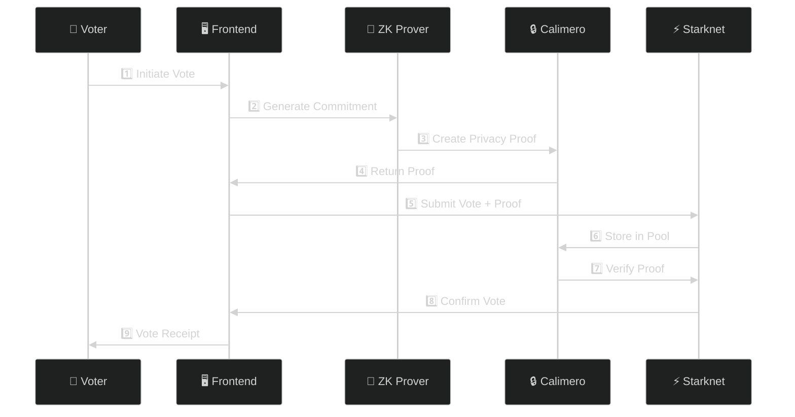

# 🗳️ Privacy-Preserving Voting System

<div align="center">


[](https://starknet.io)
[](https://calimero.network)
[](https://opensource.org/licenses/MIT)

</div>

> 🔒 A next-generation decentralized voting platform that combines the scalability of Starknet with the privacy features of Calimero Network. Cast your vote with complete anonymity while maintaining transparent verifiability.

## 🌟 Key Features

<div align="center">

| Feature | Description |
|---------|-------------|
| 🕵️‍♂️ **Anonymous Voting** | Zero-knowledge proofs ensure complete voter privacy |
| ✅ **Vote Verification** | Verify your vote without revealing your choice |
| 📊 **Ballot Management** | Create and manage customizable voting ballots |
| 🔑 **Secure Registration** | Privacy-preserving voter registration system |
| 🔄 **Proof Aggregation** | Efficient verification through ZK proof bundling |
| 🛡️ **Sybil Resistance** | Robust voter authentication with anonymity |
| ⚡ **High Performance** | Built on Starknet for maximum throughput |
| 🔐 **Private Storage** | Secure data handling via Calimero Network |

</div>

## 🏗️ System Architecture

```mermaid
%%{init: {'theme': 'dark', 'themeVariables': { 'primaryColor': '#6C5CE7', 'edgeLabelBackground':'#2D3436', 'tertiaryColor': '#2D3436'}}}%%
graph TB
    subgraph Frontend["🖥️ Frontend"]
        UI[🎨 User Interface]
        Web3[🌐 Web3 Integration]
        ZK[🔐 ZK Proof Generation]
        style Frontend fill:#6C5CE7,stroke:#2D3436,stroke-width:2px
    end

    subgraph "Starknet L2"["⚡ Starknet L2"]
        VC[📝 Voting Contract]
        BF[🏭 Ballot Factory]
        VR[📋 Voter Registry]
        style "Starknet L2" fill:#00B894,stroke:#2D3436,stroke-width:2px
    end

    subgraph "Calimero"["🔒 Calimero Privacy Layer"]
        PP[🏊‍♂️ Privacy Pool]
        PS[💾 Private Storage]
        PV[✅ Proof Verification]
        style "Calimero" fill:#FD79A8,stroke:#2D3436,stroke-width:2px
    end

    UI --> Web3
    Web3 --> VC
    UI --> ZK
    ZK --> PV
    VC --> PP
    VC --> PS
    BF --> VC
    VR --> PS
    PV --> PP

    classDef default fill:#2D3436,stroke:#2D3436,stroke-width:2px,color:white;
```

## 🔄 Vote Flow



## 🔒 Privacy Architecture

```mermaid
%%{init: {'theme': 'dark', 'themeVariables': { 'primaryColor': '#6C5CE7', 'secondaryColor': '#00B894', 'tertiaryColor': '#FD79A8'}}}%%
flowchart TB
    subgraph "🗳️ Vote Privacy"
        V[🗳️ Vote] --> EC[🔐 Encryption]
        EC --> EP[📦 Encrypted Payload]
        EP --> PP[🏊‍♂️ Privacy Pool]
        style "Vote Privacy" fill:#6C5CE7,stroke:#2D3436,stroke-width:2px
    end

    subgraph "👤 Identity Privacy"
        I[👤 Identity] --> ZK[🔐 ZK Proof]
        ZK --> VP[✅ Verification]
        VP --> AC[🎫 Anonymous Credential]
        style "Identity Privacy" fill:#00B894,stroke:#2D3436,stroke-width:2px
    end

    subgraph "💾 Data Privacy"
        PP --> PV[🔍 Private Verification]
        AC --> PV
        PV --> VC[✅ Vote Confirmation]
        style "Data Privacy" fill:#FD79A8,stroke:#2D3436,stroke-width:2px
    end
```

## 🔧 Quick Setup

```bash
# 1. Clone the repository
git clone https://github.com/yourusername/privacy-preserving-voting.git

# 2. Install dependencies
npm install

# 3. Set up environment variables
cp .env.example .env

# 4. Build contracts
scarb build

# 5. Start development server
npm run dev
```

## 📚 Documentation

<details>
<summary>📁 Project Structure</summary>

```bash
src/
├── contracts/          # Smart contracts
├── frontend/          # UI components
├── lib/               # Core libraries
└── tests/            # Test suites
```

</details>

<details>
<summary>🔧 Configuration Files</summary>

- `.env.example`: Environment variables template
- `Scarb.toml`: Cairo contract configuration
- `next.config.js`: Next.js configuration
- `hardhat.config.js`: Hardhat configuration
</details>

<details>
<summary>📦 Core Components</summary>

1. **Smart Contracts**
   - `VotingSystem.cairo`: Main voting logic
   - `BallotFactory.cairo`: Ballot management

2. **Frontend**
   - React components for voting interface
   - Web3 integration with Starknet
   - ZK proof generation and verification

3. **Privacy Layer**
   - Calimero SDK integration
   - Private data storage
   - Zero-knowledge proof system
</details>

## 🛠️ Development

```bash
# Run tests
npm run test

# Format code
npm run format

# Build for production
npm run build
```

## 🤝 Contributing

1. Fork the repository
2. Create your feature branch (`git checkout -b feature/AmazingFeature`)
3. Commit your changes (`git commit -m 'Add some AmazingFeature'`)
4. Push to the branch (`git push origin feature/AmazingFeature`)
5. Open a Pull Request

## 📄 License

This project is licensed under the MIT License - see the [LICENSE](LICENSE) file for details.

---

<div align="center">

Made with ❤️ by [Your Team Name]

[⭐ Star us on GitHub](https://github.com/yourusername/privacy-preserving-voting) | [🐦 Follow us on Twitter](https://twitter.com/yourusername)

</div>
