# 🗳️ Privacy-Preserving Voting System

<div align="center">


[](https://starknet.io)
[](https://calimero.network)
[](https://opensource.org/licenses/MIT)

</div>

> 🔒 A next-generation decentralized voting platform leveraging Starknet's STARK-based validity rollups and Calimero Network's privacy infrastructure for secure, anonymous, and verifiable voting.

## 📑 Table of Contents
1. [Key Features](#-key-features)
2. [Quick Start](#-quick-start)
3. [Technical Architecture](#-technical-architecture)
4. [Technical Deep Dive](#-technical-deep-dive)
5. [Security Architecture](#-security-architecture)
6. [Project Structure](#-project-structure)
7. [API Reference](#-api-reference)
8. [Configuration Guide](#-configuration-guide)
9. [Contributing](#-contributing)
10. [License](#-license)

## 🌟 Key Features

<div align="center">

| Feature | Description |
|---------|-------------|
| 🕵️‍♂️ **Anonymous Voting** | Calimero privacy pools with ZK proofs ensure complete voter anonymity |
| ✅ **Vote Verification** | STARK-based proof verification without revealing vote choice |
| 📊 **Ballot Management** | Smart contract-based ballot creation and management |
| 🔑 **Secure Registration** | Privacy-preserving voter registration through Calimero SDK |
| 🔄 **Proof Aggregation** | Efficient STARK proof bundling for scalable verification |
| 🛡️ **Sybil Resistance** | Calimero's identity verification with privacy preservation |
| ⚡ **High Performance** | Starknet L2 validity rollups for maximum throughput |
| 🔐 **Private Storage** | Encrypted vote storage in Calimero privacy pools |

</div>

## 🚀 Quick Start

### Prerequisites
- Node.js >= 16.0.0
- npm >= 8.0.0
- Scarb >= 0.6.0 (for Cairo contracts)
- Python >= 3.9 (for Starknet)
- Rust >= 1.70.0 (for Calimero)

### One-Click Setup
```bash
# Clone and setup
git clone https://github.com/himanshu-sugha/calVote.git
cd calVote
npm install

# Configure environment
cp .env.example .env

# Setup Calimero Network (Windows)
./scripts/setup_calimero.ps1

# Deploy contracts and start application
npm run deploy
npm run dev
```

## 🏗️ Technical Architecture

### System Components


### Vote Flow

```mermaid
sequenceDiagram
    participant V as Voter
    participant UI as Frontend
    participant C as Calimero SDK
    participant S as Starknet Contract
    
    V->>UI: 1️⃣ Cast Vote
    UI->>C: 2️⃣ Generate ZK Proof
    C->>C: 3️⃣ Encrypt Vote
    C->>S: 4️⃣ Submit to Privacy Pool
    S->>S: 5️⃣ Verify STARK Proof
    S->>C: 6️⃣ Store Encrypted Vote
    C->>S: 7️⃣ Update Merkle Root
    S->>UI: 8️⃣ Emit Events
    UI->>V: 9️⃣ Vote Receipt
```


## 🔒 Technical Deep Dive

<details>
<summary>🔐 Zero-Knowledge Proof System</summary>

Our system combines Calimero's privacy infrastructure with Starknet's STARK proofs:
You can click on options to open them
1. **Vote Commitment**
   ```cairo
   #[storage]
   struct Storage {
       vote_commitments: LegacyMap<ContractAddress, felt252>,
       voter_proofs: LegacyMap<ContractAddress, felt252>,
       privacy_pool: felt252,
   }
   ```

2. **Proof Generation**
   ```javascript
   async generateZKProof(vote, voterIdentity) {
       return await calimero.generateProof({
           vote: vote,
           identity: voterIdentity
       });
   }
   ```

3. **Verification Process**
   ```cairo
   fn _verify_calimero_proof(
       self: @ContractState,
       voter: ContractAddress,
       proof: felt252
   ) -> bool
   ```
</details>

<details>
<summary>🛡️ Privacy Mechanisms</summary>

### Calimero Integration
- **Private State Management**
  ```javascript
  class VotingPrivacy {
      constructor(networkConfig) {
          this.calimero = new CalimeroSDK(networkConfig);
      }

      async encryptVote(vote, publicKey) {
          return await this.calimero.encrypt({
              data: vote,
              publicKey: publicKey
          });
      }
  }
  ```

### Vote Privacy
1. **Vote Encryption**
   - Homomorphic encryption via Calimero SDK
   - Privacy pool-based vote storage
   - Merkle tree commitment scheme

2. **Anonymous Channels**
   - Calimero's P2P network routing
   - Privacy pool mixing
   - Decoy traffic generation
</details>

## 🛡️ Security Architecture

<details>
<summary>🔑 Anti-Sybil Measures</summary>

1. **Identity Verification**
   - Multi-factor authentication
   - Proof of personhood checks
   - Credential binding

2. **Rate Limiting**
   ```cairo
   #[starknet::interface]
   trait IRateLimit<T> {
       fn check_rate_limit(self: @T, voter: felt252) -> bool;
       fn update_last_action(ref self: T, voter: felt252);
   }
   ```

3. **Reputation System**
   - Historical voting patterns analysis
   - Behavior scoring
   - Progressive security levels
</details>

<details>
<summary>🔐 Encryption Methods</summary>

### Vote Encryption


### Key Management
1. **Distributed Key Generation**
   - Shamir's Secret Sharing
   - Threshold signatures
   - Key rotation protocol

2. **Encryption Layers**
   - Transport layer: TLS 1.3
   - Storage layer: AES-256-GCM
   - Protocol layer: Homomorphic encryption
</details>

<details>
<summary>✅ Vote Verification</summary>

### Verification Process
1. **Proof Verification**
   ```cairo
   #[starknet::interface]
   trait IVoteVerifier<T> {
       fn verify_vote(
           self: @T,
           vote_proof: Array<felt252>,
           public_inputs: Array<felt252>
       ) -> bool;
   }
   ```

2. **Receipt Generation**
   - Unique receipt ID
   - Cryptographic proof of inclusion
   - Temporal proof of voting

3. **Audit Trail**
   - Zero-knowledge audit logs
   - Verifiable delay functions
   - Privacy-preserving analytics
</details>

## 📁 Project Structure

```bash
calVote/
├── src/
│   ├── contracts/           # Smart contracts
│   │   ├── VotingSystem.cairo   # Main voting logic
│   │   └── BallotFactory.cairo  # Ballot creation & management
│   ├── frontend/           # UI components
│   │   ├── components/     # React components
│   │   └── pages/         # Next.js pages
│   ├── lib/               # Core libraries
│   │   ├── calimero/      # Calimero integration
│   │   ├── crypto/        # Cryptographic utilities
│   │   └── zk/            # Zero-knowledge proofs
│   └── tests/            # Test suites
├── scripts/              # Deployment & setup scripts
├── .env.example         # Environment variables template
├── Scarb.toml          # Cairo configuration
├── next.config.js      # Next.js configuration
└── hardhat.config.js   # Hardhat configuration
```

## 🔌 API Reference

<details>
<summary>📘 Smart Contract Interfaces</summary>

### Voting System Contract
```cairo
#[starknet::interface]
trait IVotingSystem<T> {
    // Ballot Management
    fn create_ballot(ref self: T, options: Array<felt252>) -> felt252;
    fn close_ballot(ref self: T, ballot_id: felt252);
    
    // Voting Operations
    fn cast_vote(
        ref self: T,
        ballot_id: felt252,
        vote_commitment: felt252,
        proof: Array<felt252>
    );
    fn verify_vote(self: @T, receipt_id: felt252) -> bool;
    
    // Results & Queries
    fn get_results(self: @T, ballot_id: felt252) -> Array<u256>;
    fn get_ballot_status(self: @T, ballot_id: felt252) -> u8;
}
```

### Ballot Factory Contract
```cairo
#[starknet::interface]
trait IBallotFactory<T> {
    fn create_standard_ballot(ref self: T, params: BallotParams) -> felt252;
    fn create_private_ballot(ref self: T, params: PrivateBallotParams) -> felt252;
}
```
</details>

<details>
<summary>🔄 API Endpoints</summary>

### REST API
```typescript
// Ballot Management
POST   /api/ballots/create
GET    /api/ballots/:id
PUT    /api/ballots/:id/close

// Voting
POST   /api/votes/cast
GET    /api/votes/verify/:receiptId

// Results
GET    /api/results/:ballotId
```

### WebSocket Events
```typescript
// Real-time updates
ws://host/events/ballots
ws://host/events/votes
ws://host/events/results
```
</details>

<details>
<summary>📝 Example API Usage</summary>

### Creating a Ballot
```typescript
const ballot = await contract.create_ballot({
    title: "Example Vote",
    options: ["Option 1", "Option 2"],
    start_time: Math.floor(Date.now() / 1000),
    end_time: Math.floor(Date.now() / 1000) + 86400,
    privacy_level: 2
});
```

### Casting a Vote
```typescript
const vote = await contract.cast_vote({
    ballot_id: "0x...",
    vote_commitment: "0x...",
    proof: ["0x...", "0x..."]
});
```

### Verifying a Vote
```typescript
const isValid = await contract.verify_vote({
    receipt_id: "0x..."
});
```
</details>

## ⚙️ Configuration Guide

<details>
<summary>🔧 Environment Variables</summary>

```env
# Network Configuration
STARKNET_NETWORK=        # Network to deploy to (goerli-alpha, mainnet)
STARKNET_PROVIDER_URL=   # RPC endpoint URL
STARKNET_WALLET=         # Wallet address for deployment
STARKNET_PRIVATE_KEY=    # Private key for transactions

# Calimero Configuration
CALIMERO_NODE_NAME=      # Node identifier
CALIMERO_SERVER_PORT=    # API server port (default: 2428)
CALIMERO_SWARM_PORT=     # P2P network port (default: 2528)
CALIMERO_PROTOCOL=       # Protocol type (default: starknet)
CALIMERO_API_KEY=        # API key for Calimero services
CALIMERO_SECRET=         # Secret for encryption

# Application Settings
NEXT_PUBLIC_APP_URL=     # Frontend application URL
NEXT_PUBLIC_API_URL=     # Backend API URL
ENABLE_TESTNET=          # Enable testnet features (true/false)
LOG_LEVEL=              # Logging level (debug, info, warn, error)
```
</details>

<details>
<summary>🌐 Network Configuration</summary>

### Starknet Networks
```javascript
// hardhat.config.js
module.exports = {
    starknet: {
        networks: {
            goerli: {
                url: process.env.STARKNET_PROVIDER_URL,
                chainId: "0x534e5f474f45524c49",
                feederGatewayUrl: "https://alpha4.starknet.io/feeder_gateway",
                gatewayUrl: "https://alpha4.starknet.io/gateway"
            },
            mainnet: {
                url: process.env.STARKNET_PROVIDER_URL,
                chainId: "0x534e5f4d41494e",
                feederGatewayUrl: "https://alpha-mainnet.starknet.io/feeder_gateway",
                gatewayUrl: "https://alpha-mainnet.starknet.io/gateway"
            }
        }
    }
};
```

### Calimero Network
```javascript
// calimero.config.js
module.exports = {
    nodes: [{
        name: process.env.CALIMERO_NODE_NAME,
        serverPort: process.env.CALIMERO_SERVER_PORT,
        swarmPort: process.env.CALIMERO_SWARM_PORT,
        protocol: process.env.CALIMERO_PROTOCOL
    }],
    encryption: {
        type: "AES-256-GCM",
        keyDerivation: "PBKDF2"
    }
};
```
</details>

<details>
<summary>📦 Deployment Parameters</summary>

### Contract Deployment
```typescript
// scripts/deploy.ts
const deploymentParams = {
    network: process.env.STARKNET_NETWORK,
    wallet: process.env.STARKNET_WALLET,
    contracts: {
        votingSystem: {
            salt: "0x...",
            constructorCalldata: [...],
            maxFee: "1000000000000000"
        },
        ballotFactory: {
            salt: "0x...",
            constructorCalldata: [...],
            maxFee: "1000000000000000"
        }
    }
};
```

### Verification Settings
```typescript
// scripts/verify.ts
const verificationParams = {
    compiler: {
        version: "0.6.0",
        optimization: true
    },
    sourceFiles: [
        "src/contracts/VotingSystem.cairo",
        "src/contracts/BallotFactory.cairo"
    ],
    constructorArguments: [...],
    libraries: {}
};
```
</details>

## 🤝 Contributing

1. Fork the repository
2. Create your feature branch (`git checkout -b feature/AmazingFeature`)
3. Commit your changes (`git commit -m 'Add some AmazingFeature'`)
4. Push to the branch (`git push origin feature/AmazingFeature`)
5. Open a Pull Request

## 📄 License

This project is licensed under the MIT License - see the [LICENSE](LICENSE) file for details.

---

<div align="center">

### 🛠️ Technologies Used
- **Starknet** for L2 scalability
- **Calimero Network** for privacy
- **Cairo** for smart contracts
- **Next.js** for frontend
- **Zero-Knowledge Proofs** for anonymity

Made with ❤️ by Himanshu Sugha

[⭐ Star us on GitHub](https://github.com/himanshu-sugha/calVote)

</div>
