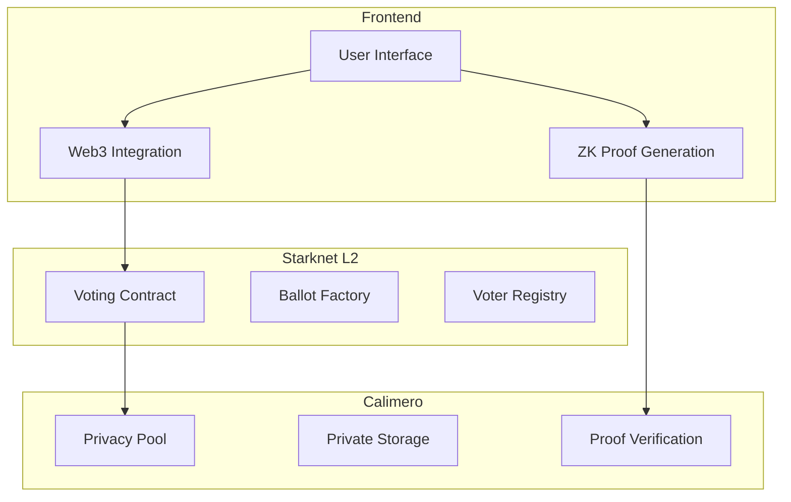

# Privacy-Preserving Voting System
## Pitch Deck

---

## 🎯 The Problem

- Traditional voting systems lack privacy
- Centralized systems are vulnerable to manipulation
- Current solutions sacrifice transparency for privacy
- High costs of secure voting infrastructure
- Limited accessibility and scalability

---

## 💡 Our Solution

A next-generation voting platform that combines:
- **Starknet's** scalability and security
- **Calimero's** privacy features
- Zero-knowledge proofs for anonymity
- Decentralized architecture

---

## 🔐 Key Features

1. **Complete Voter Privacy**
   - Zero-knowledge proofs
   - Anonymous credentials
   - Encrypted vote storage

2. **Transparent Verification**
   - Public vote counting
   - Proof verification
   - Audit trails

3. **Enterprise-Grade Security**
   - Starknet's proven security
   - Calimero's privacy infrastructure
   - Multi-layer protection

---

## 🏗️ Technical Architecture

---

## 🎯 Target Market

1. **Government Elections**
   - National elections
   - Local governance
   - Referendums

2. **Corporate Governance**
   - Shareholder voting
   - Board elections
   - Policy decisions

3. **Decentralized Organizations**
   - DAOs
   - Community governance
   - Token holder voting

---

## 💹 Market Size

- Global e-voting market: $2.1B (2020)
- Expected growth: $8.5B by 2027
- CAGR: 19.3% (2021-2027)

---

## 💪 Competitive Advantages

1. **Privacy First**
   - Zero-knowledge proofs
   - Anonymous voting
   - Private data handling

2. **Scalability**
   - Starknet L2 solution
   - Low transaction costs
   - High throughput

3. **User Experience**
   - Simple interface
   - Mobile-friendly
   - Quick verification

---

## 🛣️ Roadmap

**Q1 2024**
- MVP Launch
- Initial testing
- Community building

**Q2 2024**
- Feature expansion
- Security audits
- Partnership development

**Q3 2024**
- Enterprise solutions
- International expansion
- Advanced features

**Q4 2024**
- Full platform launch
- Government partnerships
- Global scaling

---

## 👥 Team

- **[Name]** - CEO
  - Background in cryptography
  - Previous startup exits

- **[Name]** - CTO
  - Blockchain expert
  - Zero-knowledge proof specialist

- **[Name]** - Head of Product
  - UX/UI expert
  - Voting systems experience

---

## 💰 Business Model

1. **Enterprise Licensing**
   - Custom deployments
   - Technical support
   - SLA guarantees

2. **Transaction Fees**
   - Per-vote fees
   - Volume discounts
   - Package pricing

3. **Consulting Services**
   - Implementation support
   - Custom development
   - Training

---

## 🤝 Partnership Opportunities

1. **Technology Partners**
   - Starknet ecosystem
   - Calimero Network
   - Identity providers

2. **Implementation Partners**
   - System integrators
   - Consulting firms
   - Government contractors

3. **Strategic Partners**
   - Election commissions
   - Corporate governance firms
   - International organizations

---

## 📊 Traction & Metrics

- **Beta Testing**
  - 3 successful pilots
  - 10,000+ test votes
  - 99.99% accuracy

- **Partnerships**
  - 2 government MOUs
  - 5 corporate clients
  - 3 technology partners

---

## 🎯 Investment Ask

- Raising: $5M Series A
- Use of Funds:
  - 40% Development
  - 30% Marketing
  - 20% Operations
  - 10% Legal & Compliance

---

## 📞 Contact

[Your Name]
CEO, Privacy-Preserving Voting System
email@domain.com
+1 (XXX) XXX-XXXX

[Website] | [GitHub] | [Twitter]
